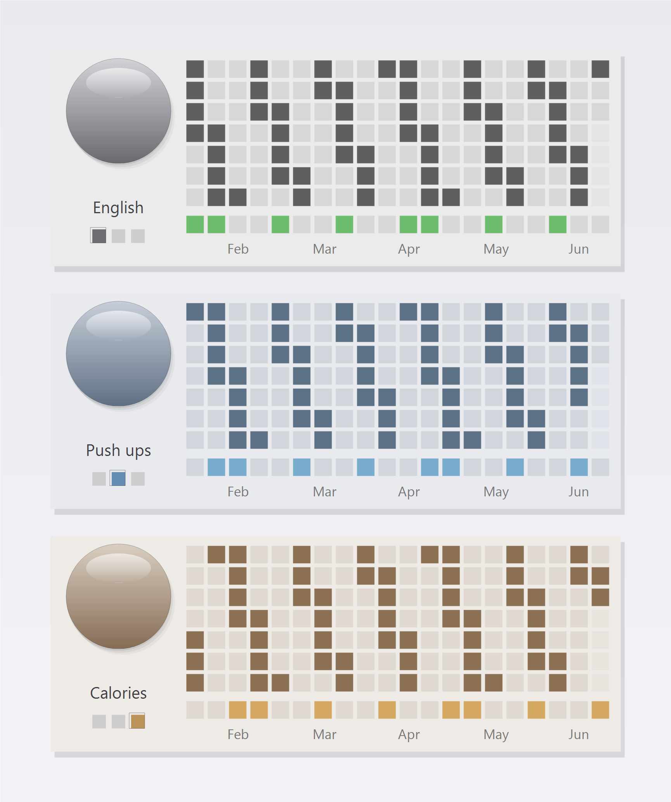

# Habit Tracker Widget

A minimal, always-on-desktop habit tracker for Windows 10/11. It lives on the wallpaper layer beneath every window, tracks several goals on a 20-week grid, and stays out of your way.

Built with PowerShell and WinForms. No installer, no dependencies beyond the PowerShell that already ships with Windows.



## Features

- Multiple goals in one widget (for example English, Push ups, Calories). Switch with a single click.
- A 20-week activity grid per goal, in the style of a contributions calendar.
- A weekly summary row that fills with the goal's accent color once you reach your weekly target.
- A soft, distinct color theme per goal. The grid and the dial pick up the goal's hue.
- One-tap daily marking on the dial, plus a global hotkey.
- Sits below all windows, never steals focus, and stays out of the taskbar and Alt-Tab.
- Remembers its position and all data across reboots.

## Layout

- Left column: a dial (the day button), the active goal's name, and a three-square switcher (one square per goal, the active one highlighted).
- Grid: 20 columns by 7 rows. Each column is a week (Monday at the top, Sunday at the bottom). The rightmost column is the current week, and history scrolls left as weeks roll over. Data older than 20 weeks drops off.
- Bottom row: the weekly summary. A week's square fills with the goal's accent color once that week has at least N marked days (configurable per goal, default 4).
- Month labels (Feb, Mar, and so on) sit under the week that contains the first day of each month.
- Today's cell carries a dark border that advances at midnight Pacific time.

## Interaction

- **Left-click the dial** to mark today done for the active goal. If today is already marked, nothing changes; use right-click then Unmark today to undo.
- **Click a switcher square** to switch to that goal. **Click the goal name** to cycle to the next goal. The grid, the summary, the name, and the color theme all switch together.
- **Drag** (hold the left button and move) to reposition the widget. The position is saved.
- **Right-click** to configure goals: rename, add, remove, set the weekly target, unmark today, or close the widget. The menu header shows the active goal and its position, for example `English (1/3)`.
- **Global hotkey Ctrl+Alt+Shift+O** marks today for the active goal from anywhere.

The dial is deliberately set apart from the name and the switcher, so picking a goal never marks a day by accident.

## Goals and color themes

Each goal slot has its own muted theme (neutral gray, slate blue, warm amber, sage green, soft plum), cycling if you add more than five goals. The themes stay soft on purpose, so the widget reads as one calm surface rather than a row of bright badges.

## Timezone and rollover

All day and week math runs in Pacific Time and handles daylight saving automatically. A 30-second timer notices the date change and rotates the grid and the today-border right at midnight PT. To anchor to a different zone, change the time zone id near the top of `habit_widget.ps1`.

## Data

State lives at `%APPDATA%\HabitWidget\data.json`, never in this folder.

```json
{
  "version": 2,
  "active": 0,
  "goals": [
    { "name": "English",  "days": { "2026-04-14": true }, "threshold": 4 },
    { "name": "Push ups", "days": {}, "threshold": 4 },
    { "name": "Calories", "days": {}, "threshold": 4 }
  ],
  "posX": 1320,
  "posY": 20
}
```

A `version: 1` file from an earlier single-goal build is migrated automatically on first run: your existing goal becomes the first goal, and Push ups and Calories are added alongside it.

## Install

1. Put this folder anywhere, for example `C:\Users\<you>\HabitWidget\`.
2. Double-click `install.bat`. It adds a shortcut to the Startup folder and launches the widget.
3. The widget starts automatically on each login.

## Uninstall

Run `uninstall.bat`, then close the widget via right-click then Close widget (or reboot).

## Files

| file               | purpose                                                |
| ------------------ | ------------------------------------------------------ |
| `habit_widget.ps1` | main PowerShell and WinForms widget                    |
| `HabitWidget.vbs`  | silent launcher (no console window)                    |
| `HabitWidget.bat`  | alternative launcher (brief console flash, for debug)  |
| `install.bat`      | creates a Startup shortcut and launches the widget     |
| `uninstall.bat`    | removes the Startup shortcut                           |

## How it stays below other windows

The widget is a normal borderless form with the `WS_EX_NOACTIVATE | WS_EX_TOOLWINDOW` extended styles, pushed to the bottom of the z-order with `SetWindowPos(HWND_BOTTOM)`. A 3-second timer re-sinks it so it stays beneath any freshly activated window. The `NOACTIVATE` style means clicks register without the widget ever becoming the active window, so it never steals focus from the app you are using.

## Requirements

- Windows 10 or 11
- Windows PowerShell 5.1 (preinstalled). No extra packages.

## License

MIT. See [LICENSE](LICENSE).
